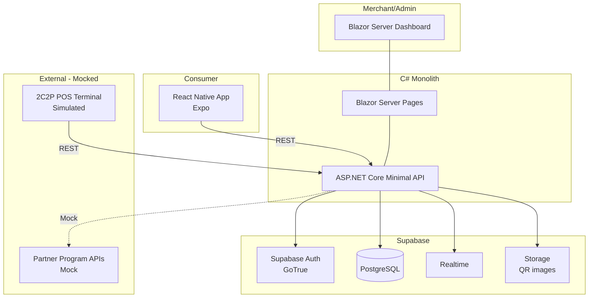
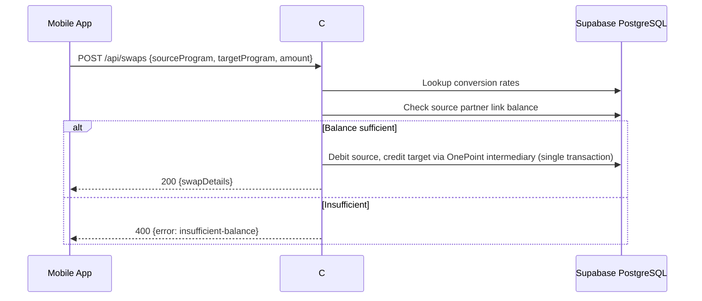
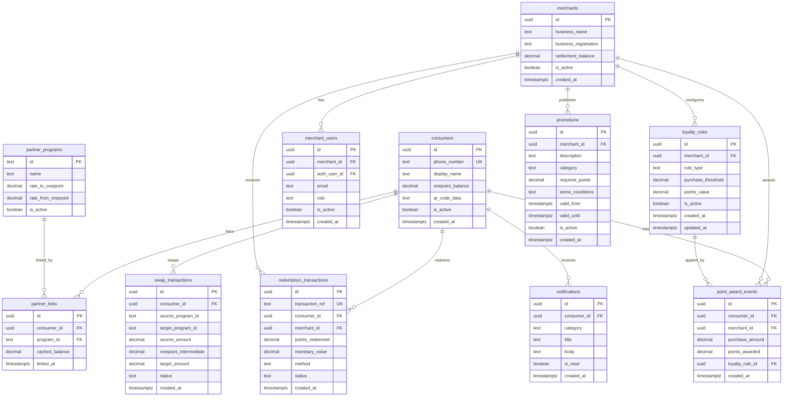

;# Design Document: OnePoint Loyalty Engine

## Overview

OnePoint is a unified loyalty exchange engine for the 2C2P Payment Gateway. Consumers aggregate loyalty points from multiple partner programs, convert them through a universal intermediary currency (OnePoint), and spend consolidated points at 2C2P merchants via QR payment.

This is a 2-day hackathon MVP. The architecture is intentionally minimal: a single C# Web API, Supabase for database and auth, and a lightweight mobile app.

### Key Design Decisions

| Decision | Choice | Rationale |
|---|---|---|
| Backend | C# ASP.NET Core Minimal API | Fast to scaffold, strong typing, single project |
| Database + Auth | Supabase (PostgreSQL + GoTrue Auth) | Managed DB, built-in auth with SSO/OTP, zero infra setup |
| Dashboard | C# Blazor Server | Same language as API, fast to build with component model, no separate SPA build step |
| Mobile App | React Native (Expo) | Cross-platform, fast iteration with Expo Go for demo |
| Architecture | Monolith | Single deployable C# project hosts both API and Dashboard |
| Notifications | Supabase Realtime + in-app only | Skip FCM for MVP; use Supabase realtime subscriptions and an in-app notification table |
| Session Management | Supabase Auth JWT tokens | No custom token logic; Supabase handles JWT issuance and refresh |

### What's In / Out for MVP

| In Scope | Out of Scope |
|---|---|
| Consumer registration (phone + OTP via Supabase) | Real SMS OTP (use Supabase magic link or test OTP) |
| SSO login (Google via Supabase Auth) | Multiple SSO providers (LINE, Facebook) |
| OnePoint balance display | Real partner API integrations |
| Point redemption via User ID / QR code | Real POS terminal integration |
| Point award based on loyalty rules | Real-time POS webhook |
| Mock point swap with static conversion rates | Live partner program OAuth flows |
| Transaction history | CSV export |
| Promotions listing | Promotion filtering by location |
| Dashboard overview with basic stats | Charts / time-series analytics |
| Admin merchant + user management | POS terminal provisioning |
| Loyalty rule configuration | Complex multi-tier rules |
| In-app notifications table | Push notifications via FCM |

---

## Architecture

### High-Level Architecture



### Request Flow — Point Redemption

```mermaid
sequenceDiagram
    participant POS as POS / App
    participant API as C# API
    participant DB as Supabase PostgreSQL

    POS->>API: POST /api/redemptions {userId, amount, merchantId}
    API->>DB: Check consumer balance
    alt Balance sufficient
        API->>DB: BEGIN; debit consumer, credit merchant, insert transaction; COMMIT
        API-->>POS: 200 {transactionRef, status: approved}
        API->>DB: Insert notification record
    else Balance insufficient
        API-->>POS: 400 {error: insufficient-balance, available: X}
    end
```

### Request Flow — Point Swap (Mocked)



---

## Components and Interfaces

### 1. Mobile App (React Native / Expo)

Minimal screens for demo:

| Screen | Description | Requirements |
|---|---|---|
| LoginScreen | Supabase Auth UI (email/password + Google SSO) | Req 1 |
| RegisterScreen | Phone number + OTP (Supabase magic link for MVP) | Req 2 |
| HomeScreen | OnePoint balance + partner balances | Req 3, 4 |
| QRScreen | QR code display encoding User ID | Req 3 |
| HistoryScreen | Paginated redemption transaction list | Req 5 |
| PromotionsScreen | List of active promotions | Req 6 |
| SwapScreen | Link partners + swap points | Req 7 |
| ProfileScreen | Profile info, logout | Req 8 |
| NotificationsScreen | In-app notification list | Req 9 |

The App communicates with the API via `fetch` using the Supabase JWT token in the `Authorization` header.

### 2. Dashboard (Blazor Server)

| Page | Role | Description | Requirements |
|---|---|---|---|
| Login | All | Supabase SSO redirect | Req 10 |
| Overview | Merchant_User / Admin | Transaction count, points redeemed, monetary value | Req 11 |
| Transactions | Merchant_User / Admin | Filterable transaction table | Req 12 |
| Merchants | Admin | Create/edit/deactivate merchants and merchant users | Req 13 |
| LoyaltyRules | Merchant_User | Configure earn/redeem rules | Req 14 |
| Promotions | Merchant_User | Create/manage promotions | Req 21 (via API) |

Role-based access is enforced by checking the user's role claim from Supabase Auth. Blazor Server renders server-side so there's no separate API call layer — it calls the same service classes the API uses.

### 3. C# API (ASP.NET Core Minimal API)

#### Endpoint Summary

| Group | Method | Path | Requirements |
|---|---|---|---|
| Auth | POST | `/api/auth/register` | Req 17 |
| Auth | POST | `/api/auth/login` | Req 17 |
| Auth | DELETE | `/api/auth/account` | Req 17 |
| Auth | PUT | `/api/auth/profile` | Req 17 |
| Balance | GET | `/api/balance/{userId}` | Req 4, 16 |
| Redemptions | POST | `/api/redemptions` | Req 15 |
| Redemptions | GET | `/api/redemptions?consumerId=&page=&pageSize=` | Req 5, 12 |
| Points | POST | `/api/points/award` | Req 16 |
| Swaps | POST | `/api/swaps` | Req 18 |
| Swaps | GET | `/api/swaps/rates?source=&target=` | Req 18 |
| Partners | POST | `/api/partners/link` | Req 18 |
| Partners | DELETE | `/api/partners/{programId}` | Req 18 |
| Partners | GET | `/api/partners` | Req 7 |
| Merchants | POST | `/api/merchants` | Req 20 |
| Merchants | GET | `/api/merchants` | Req 20 |
| Merchants | PUT | `/api/merchants/{id}` | Req 20 |
| Merchants | DELETE | `/api/merchants/{id}` | Req 20 |
| MerchantUsers | POST | `/api/merchants/{id}/users` | Req 20 |
| MerchantUsers | GET | `/api/merchants/{id}/users` | Req 20 |
| LoyaltyRules | POST | `/api/loyalty-rules` | Req 20 |
| LoyaltyRules | GET | `/api/loyalty-rules/{merchantId}` | Req 20 |
| LoyaltyRules | PUT | `/api/loyalty-rules/{id}` | Req 20 |
| Promotions | POST | `/api/promotions` | Req 21 |
| Promotions | GET | `/api/promotions?merchantId=&category=` | Req 21 |
| Promotions | GET | `/api/promotions/{id}` | Req 21 |
| Notifications | GET | `/api/notifications` | Req 19 |
| Notifications | PATCH | `/api/notifications/{id}/read` | Req 19 |
| Dashboard | GET | `/api/dashboard/overview?merchantId=&period=` | Req 11 |

#### Service Layer (C# Classes)

```csharp
// Services/RedemptionService.cs
public class RedemptionService
{
    Task<RedemptionResult> ProcessRedemption(string consumerId, string merchantId, decimal amount, string method);
    Task<PagedResult<RedemptionTransaction>> GetTransactions(TransactionFilter filter, int page, int pageSize);
}

// Services/PointAwardService.cs
public class PointAwardService
{
    Task<AwardResult> AwardPoints(string consumerId, string merchantId, decimal purchaseAmount);
}

// Services/SwapService.cs
public class SwapService
{
    Task<SwapPreview> CalculateSwap(string sourceProgram, string targetProgram, decimal amount);
    Task<SwapResult> ExecuteSwap(string consumerId, SwapPreview preview);
}

// Services/MerchantService.cs
public class MerchantService
{
    Task<Merchant> CreateMerchant(MerchantInput input);
    Task DeactivateMerchant(Guid id);
    Task<MerchantUser> CreateMerchantUser(Guid merchantId, MerchantUserInput input);
}

// Services/LoyaltyRuleService.cs
public class LoyaltyRuleService
{
    Task<LoyaltyRule> CreateRule(Guid merchantId, LoyaltyRuleInput input);
    Task<LoyaltyRule> UpdateRule(Guid ruleId, LoyaltyRuleInput input);
    Task<LoyaltyRule?> GetActiveRule(Guid merchantId);
}

// Services/PromotionService.cs
public class PromotionService
{
    Task<Promotion> CreatePromotion(Guid merchantId, PromotionInput input);
    Task<PagedResult<Promotion>> GetActivePromotions(PromotionFilter? filter);
}

// Services/NotificationService.cs
public class NotificationService
{
    Task CreateNotification(string consumerId, string category, string title, string body);
    Task<List<Notification>> GetUnread(string consumerId);
    Task MarkAsRead(Guid notificationId);
}
```

#### Middleware / Pipeline

```csharp
// Program.cs — minimal setup
builder.Services.AddSupabaseClient(config);  // Supabase .NET client
builder.Services.AddScoped<RedemptionService>();
builder.Services.AddScoped<PointAwardService>();
// ... register all services

app.UseAuthentication();  // Supabase JWT validation
app.UseAuthorization();   // Role-based policies: "Admin", "MerchantUser", "Consumer"
app.MapGroup("/api").RequireAuthorization();
```

---

## Data Models

All tables live in Supabase PostgreSQL. Row Level Security (RLS) policies enforce access control at the database level.

### Entity Relationship Diagram



### Key Constraints (Supabase SQL)

```sql
-- consumers
ALTER TABLE consumers ADD CONSTRAINT chk_balance_non_negative CHECK (onepoint_balance >= 0);

-- loyalty_rules
ALTER TABLE loyalty_rules ADD CONSTRAINT chk_threshold_positive CHECK (purchase_threshold > 0);
ALTER TABLE loyalty_rules ADD CONSTRAINT chk_points_positive CHECK (points_value > 0);

-- promotions
ALTER TABLE promotions ADD CONSTRAINT chk_valid_period CHECK (valid_from < valid_until);

-- redemption_transactions
ALTER TABLE redemption_transactions ADD CONSTRAINT chk_redemption_status
  CHECK (status IN ('pending', 'approved', 'failed', 'reversed'));

-- swap_transactions
ALTER TABLE swap_transactions ADD CONSTRAINT chk_swap_status
  CHECK (status IN ('pending', 'completed', 'failed', 'reversed'));

-- partner_links: one link per consumer per program
ALTER TABLE partner_links ADD CONSTRAINT uq_consumer_program UNIQUE (consumer_id, program_id);
```

### Supabase Auth Integration

- Consumers authenticate via Supabase Auth (phone OTP or email/password). The `auth.users.id` maps to `consumers.id`.
- Dashboard users (Merchant_User, Admin) authenticate via Supabase Auth SSO (Google). The `auth.users.id` maps to `merchant_users.auth_user_id`.
- Role is stored in `merchant_users.role` and injected into the JWT via a Supabase database function hook.
- RLS policies use `auth.uid()` to scope data access per user.

### Supabase RLS Policy Examples

```sql
-- Consumers can only read their own data
CREATE POLICY "consumers_own_data" ON consumers
  FOR SELECT USING (id = auth.uid());

-- Merchant users can only see their merchant's transactions
CREATE POLICY "merchant_transactions" ON redemption_transactions
  FOR SELECT USING (
    merchant_id IN (
      SELECT merchant_id FROM merchant_users WHERE auth_user_id = auth.uid()
    )
  );

-- Admins can see all merchants
CREATE POLICY "admin_all_merchants" ON merchants
  FOR ALL USING (
    EXISTS (SELECT 1 FROM merchant_users WHERE auth_user_id = auth.uid() AND role = 'admin')
  );
```


## Correctness Properties

*A property is a characteristic or behavior that should hold true across all valid executions of a system — essentially, a formal statement about what the system should do. Properties serve as the bridge between human-readable specifications and machine-verifiable correctness guarantees.*

### Property 1: Registration round-trip

*For any* valid phone number, registering a consumer should produce a consumer record with a unique User_ID and a non-empty QR code, and querying that consumer by User_ID should return the same phone number.

**Validates: Requirements 2.2, 2.5, 17.1**

### Property 2: Duplicate phone rejection

*For any* phone number already associated with an existing consumer, attempting to register again with that phone number should be rejected with an "already registered" error, and the existing account should remain unchanged.

**Validates: Requirements 2.4**

### Property 3: QR code encodes User ID

*For any* consumer, decoding their QR code data should resolve to their User_ID. This is a round-trip property on QR encoding/decoding.

**Validates: Requirements 3.2, 15.2**

### Property 4: QR code refresh produces distinct codes

*For any* consumer, generating a new QR code should produce a value different from the previous QR code.

**Validates: Requirements 3.4**

### Property 5: Balance retrieval includes all linked partners

*For any* consumer with N linked partner programs, the balance endpoint should return the consumer's OnePoint balance and exactly N partner balances, one per linked program.

**Validates: Requirements 4.1, 4.3**

### Property 6: Transaction history scoped to consumer

*For any* consumer, the transaction history endpoint should return only redemption transactions where the consumer_id matches the authenticated consumer. No transactions belonging to other consumers should appear.

**Validates: Requirements 5.1**

### Property 7: Transaction response contains required fields

*For any* redemption transaction returned by the API, the response must include merchant name, date, time, points redeemed, and transaction reference. No field should be null or missing.

**Validates: Requirements 5.2, 15.9**

### Property 8: Pagination completeness

*For any* consumer with K redemption transactions, iterating through all pages (with a fixed page size) should yield exactly K transactions with no duplicates and no omissions.

**Validates: Requirements 5.3**

### Property 9: Active promotions filtering

*For any* set of promotions in the database, the active promotions endpoint should return only promotions where `is_active = true` and `valid_until > now`. Expired or inactive promotions must never appear.

**Validates: Requirements 6.1, 21.3**

### Property 10: Promotion response contains required fields

*For any* promotion returned by the listing endpoint, the response must include merchant name, description, validity period, and required points.

**Validates: Requirements 6.2**

### Property 11: Partner linking round-trip

*For any* consumer and partner program, after successfully linking, querying the consumer's partner links should include that program with a cached balance. After unlinking, the program should no longer appear.

**Validates: Requirements 7.2, 7.4, 7.8, 18.1**

### Property 12: Swap conversion calculation

*For any* source amount, source program rate_to_onepoint, and target program rate_from_onepoint, the swap preview should calculate target_amount = source_amount × rate_to_onepoint × rate_from_onepoint. The intermediary OnePoint amount should equal source_amount × rate_to_onepoint.

**Validates: Requirements 7.5, 18.2**

### Property 13: Swap balance conservation

*For any* confirmed point swap, the source partner link's cached_balance should decrease by source_amount and the target partner link's cached_balance should increase by the calculated target_amount. If the credit fails, the source balance should be restored to its pre-swap value.

**Validates: Requirements 7.6, 18.3, 18.4**

### Property 14: Swap insufficient balance rejection

*For any* swap request where the requested amount exceeds the source partner link's cached_balance, the swap should be rejected and both source and target balances should remain unchanged.

**Validates: Requirements 7.7, 18.5**

### Property 15: Profile update round-trip

*For any* consumer and valid profile update (display_name change), reading the profile after update should reflect the new values.

**Validates: Requirements 8.2, 17.4**

### Property 16: Account deactivation

*For any* consumer, after requesting account deletion, the consumer's `is_active` flag should be `false`.

**Validates: Requirements 8.5, 17.5**

### Property 17: Notifications created on business events

*For any* completed redemption transaction or point award event, a notification record should be created for the affected consumer with the correct category and non-empty title/body. If the consumer has disabled that notification category, no notification should be created.

**Validates: Requirements 9.1, 9.3, 9.4, 19.1, 19.3, 19.5**

### Property 18: Notification retrieval round-trip

*For any* notification stored for a consumer, it should appear in the unread notifications endpoint. After marking it as read, it should no longer appear in the unread list.

**Validates: Requirements 19.4**

### Property 19: Role-based data scoping

*For any* merchant_user, querying transactions or dashboard stats should return only data for their associated merchant. *For any* admin user, the same queries should return data across all merchants.

**Validates: Requirements 10.4, 12.1**

### Property 20: Dashboard overview stats accuracy

*For any* merchant with a set of redemption transactions in a given period, the overview endpoint should return a transaction count equal to the number of transactions, total points equal to the sum of points_redeemed, and total monetary value equal to the sum of monetary_value.

**Validates: Requirements 11.1**

### Property 21: Transaction filtering invariant

*For any* filter criteria (date range, status, minimum amount), all returned transactions should satisfy every active filter condition. No transaction violating any filter should appear in the results.

**Validates: Requirements 12.2**

### Property 22: Transaction sorting invariant

*For any* sort field (date, amount, status) and sort direction, the returned transaction list should be ordered according to that field and direction.

**Validates: Requirements 12.3**

### Property 23: Merchant creation round-trip

*For any* valid merchant input (business name, registration), creating a merchant via the API should produce a retrievable merchant record with matching fields. Only admin users should be able to perform this operation.

**Validates: Requirements 13.1, 13.6, 20.1, 20.6**

### Property 24: Merchant deactivation cascade

*For any* merchant, deactivating it should set `is_active = false` on the merchant and on all associated merchant_users.

**Validates: Requirements 13.4**

### Property 25: Loyalty rule validation

*For any* loyalty rule input, if all numeric values (purchase_threshold, points_value) are positive, the rule should be created successfully. If any value is zero, negative, or non-numeric, the API should reject with a validation error.

**Validates: Requirements 14.2, 14.3, 14.4, 14.5, 20.3**

### Property 26: Redemption balance debit and merchant credit

*For any* consumer with sufficient OnePoint_Balance and a valid redemption request, the consumer's balance should decrease by points_redeemed and the merchant's settlement_balance should increase by the corresponding monetary_value. The transaction should have status "approved" and a unique transaction_ref.

**Validates: Requirements 15.1, 15.3, 15.7**

### Property 27: Redemption insufficient balance rejection

*For any* redemption request where the amount exceeds the consumer's OnePoint_Balance, the transaction should be rejected, and the consumer's balance and merchant's settlement_balance should remain unchanged.

**Validates: Requirements 15.4**

### Property 28: Redemption failure reversal

*For any* redemption that fails after the consumer's balance has been debited, the consumer's balance should be restored to its pre-transaction value and the transaction status should be "reversed".

**Validates: Requirements 15.8**

### Property 29: Point award calculation

*For any* consumer, merchant with an active loyalty rule (threshold T, value V), and purchase amount A, the awarded points should equal `floor(A / T) * V`, and the consumer's OnePoint_Balance should increase by that amount.

**Validates: Requirements 16.1, 16.2**

### Property 30: Event logging completeness

*For any* redemption transaction, point award event, or swap transaction, a corresponding record should exist in the database containing all required fields (consumer ID, merchant ID, amounts, timestamp) with no null values in required columns.

**Validates: Requirements 15.9, 16.7, 18.6**

### Property 31: Validation error specificity

*For any* API request with missing or invalid required fields (merchant creation, merchant user creation, promotion creation, loyalty rule creation), the API should return a 400 response with a body that lists the specific fields that failed validation.

**Validates: Requirements 13.3, 20.5, 21.5**

### Property 32: Promotion creation round-trip

*For any* valid promotion input (description, validity period with valid_from < valid_until, required_points > 0), creating a promotion should produce a retrievable promotion record with matching fields and `is_active = true`.

**Validates: Requirements 21.1, 21.4**

### Property 33: Generic authentication error

*For any* invalid credential pair (wrong username, wrong password, or both), the API should return the same generic error message that does not reveal which specific credential was incorrect.

**Validates: Requirements 1.3, 17.3**

---

## Error Handling

### API Error Response Format

All API errors return a consistent JSON structure:

```json
{
  "error": {
    "code": "insufficient-balance",
    "message": "Consumer balance of 50 is less than requested 100",
    "details": {}
  }
}
```

### Error Categories

| HTTP Status | Error Code | Trigger |
|---|---|---|
| 400 | `validation-error` | Missing/invalid fields in request body |
| 400 | `insufficient-balance` | Redemption or swap amount exceeds available balance |
| 400 | `already-registered` | Phone number already in use |
| 400 | `no-rule-configured` | Point award for merchant without active loyalty rule |
| 400 | `invalid-promotion` | Promotion with invalid dates or negative points |
| 401 | `authentication-failure` | Invalid credentials (generic, no field hint) |
| 401 | `token-expired` | JWT token has expired |
| 403 | `forbidden` | User lacks required role for the operation |
| 404 | `not-found` | Resource (consumer, merchant, transaction) not found |
| 404 | `invalid-identifier` | Invalid User_ID or QR code |
| 409 | `swap-failure` | Swap credit failed after debit; debit reversed |
| 409 | `transaction-failure` | Redemption failed after debit; debit reversed |
| 500 | `internal-error` | Unexpected server error |

### Transaction Safety

- All point debits/credits use Supabase PostgreSQL transactions (`BEGIN`/`COMMIT`/`ROLLBACK`)
- The `consumers.onepoint_balance >= 0` CHECK constraint prevents negative balances at the DB level
- Failed redemptions and swaps trigger automatic reversal within the same transaction scope
- Idempotency: redemption requests include a client-generated idempotency key to prevent double-processing

### Supabase-Specific Error Handling

- Supabase Auth errors (invalid OTP, SSO failure) are caught and mapped to the standard error format
- RLS policy violations return 403 with `forbidden` error code
- Database constraint violations (e.g., duplicate phone, negative balance) are caught and mapped to appropriate 400 errors

---

## Testing Strategy

### Dual Testing Approach

This project uses both unit tests and property-based tests for comprehensive coverage:

- **Unit tests** (xUnit): Verify specific examples, edge cases, integration points, and error conditions
- **Property-based tests** (FsCheck with xUnit): Verify universal properties across randomly generated inputs

Both are complementary. Unit tests catch concrete bugs with known inputs. Property tests verify general correctness across the input space.

### Property-Based Testing Configuration

- **Library**: FsCheck (https://fscheck.github.io/FsCheck/) — the standard PBT library for .NET/C#
- **Runner**: FsCheck.Xunit integration for running property tests alongside unit tests
- **Iterations**: Minimum 100 iterations per property test
- **Tag format**: Each property test must include a comment referencing the design property:
  `// Feature: onepoint-loyalty-engine, Property {N}: {property title}`
- Each correctness property (Properties 1–33) must be implemented by a single property-based test

### Unit Test Focus Areas

- Specific redemption scenarios (exact amounts, boundary balances)
- Edge cases: zero balance redemption, expired QR codes, deactivated merchants
- Integration: Supabase Auth token validation, RLS policy enforcement
- Error conditions: all error codes in the error handling table
- Loyalty rule edge cases: purchase amount exactly at threshold, fractional calculations

### Property Test Focus Areas

- All 33 correctness properties defined above
- Generators for: Consumer (random phone, name, balance), Merchant (random business details), LoyaltyRule (random positive thresholds/values), RedemptionRequest (random amounts), SwapRequest (random programs and amounts), Promotion (random dates, points)
- Shrinkers: FsCheck's built-in shrinkers for primitives; custom shrinkers for domain types if needed

### Test Project Structure

```
tests/
  OnePoint.Tests/
    OnePoint.Tests.csproj          # xUnit + FsCheck.Xunit
    Properties/
      RedemptionPropertyTests.cs   # Properties 26-28, 30
      SwapPropertyTests.cs         # Properties 12-14
      PointAwardPropertyTests.cs   # Properties 29-30
      ConsumerPropertyTests.cs     # Properties 1-5, 15-16, 33
      MerchantPropertyTests.cs     # Properties 23-25, 31
      PromotionPropertyTests.cs    # Properties 9-10, 32
      NotificationPropertyTests.cs # Properties 17-18
      DashboardPropertyTests.cs    # Properties 19-22
      PartnerPropertyTests.cs      # Properties 6, 8, 11
    Unit/
      RedemptionServiceTests.cs
      PointAwardServiceTests.cs
      SwapServiceTests.cs
      LoyaltyRuleServiceTests.cs
      ValidationTests.cs
    Generators/
      DomainGenerators.cs          # FsCheck Arbitrary instances for domain types
```

